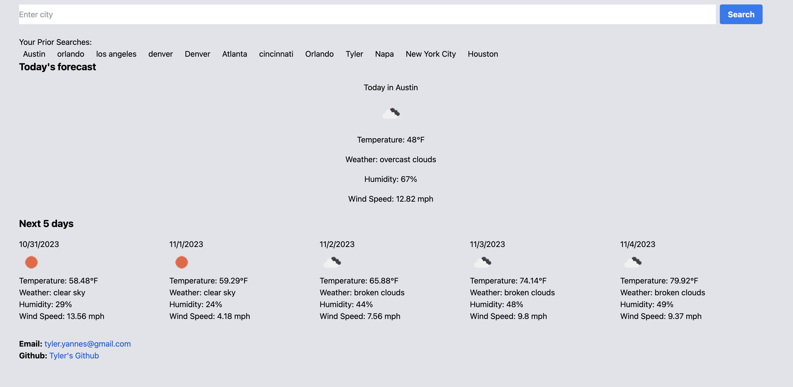

# weather-forecast-app
A repo for an app that leverages the weather API to forecast out 5 days for any searchable city.

## User Story
AS A traveler or a local resident
I WANT to know the current weather and the forecast for the next few days of a particular city
SO THAT I can plan my activities accordingly

## Acceptance Criteria
GIVEN I want to know the weather of a city
WHEN I enter the city's name into the search input
THEN I am presented with the current weather conditions of that city
WHEN I view the current weather conditions
THEN I am shown details such as temperature, humidity, wind speed, and an icon representation of the weather conditions
WHEN I scroll down
THEN I am presented with a 5-day forecast of that city with similar details for each day
WHEN I view my prior searches
THEN they are displayed in a sidebar for easy access
WHEN I click on a prior search city
THEN I am presented with the current and forecasted weather conditions of that city again
WHEN I reload the page
THEN my prior searches persist and are still visible on the sidebar

## Webpage Overview
- Header: Features the app title, a brief description, and a search bar for entering city names.
- Main Content: The current weather conditions of the searched city, followed by a 5-day forecast. Each day showcases key details like temperature, wind speed, humidity, and a weather icon.

## App Structure and Features
- Dynamic Forecast: Weather details are fetched in real-time from a weather API and presented dynamically to the user.
- Local Storage: Previously searched cities are saved into the browser's local storage. They remain accessible even after refreshing the page.
- Interactive Sidebar: Users can click on prior searches in the sidebar to quickly view weather details of those cities again.
- Weather Icons: Visual icons provide a quick representation of the current weather conditions.
- External Libraries: The app uses Tailwind CSS for styling and might utilize other external tools for fetching weather data and enhancing the user experience.

## App Screenshot

## App Url Link
https://tyleryannes94.github.io/weather-forecast-app/